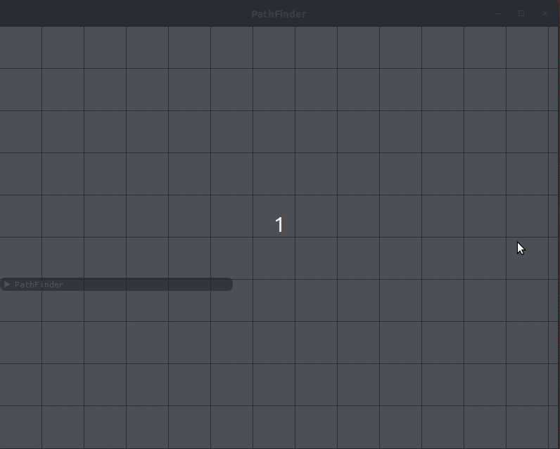
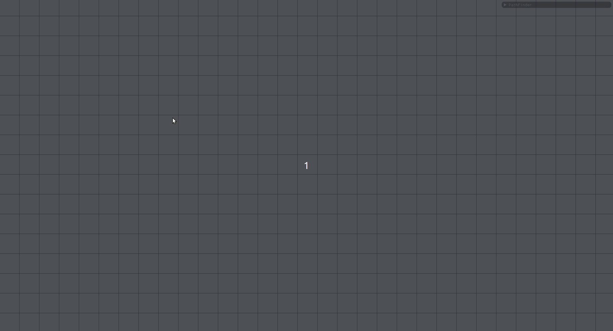
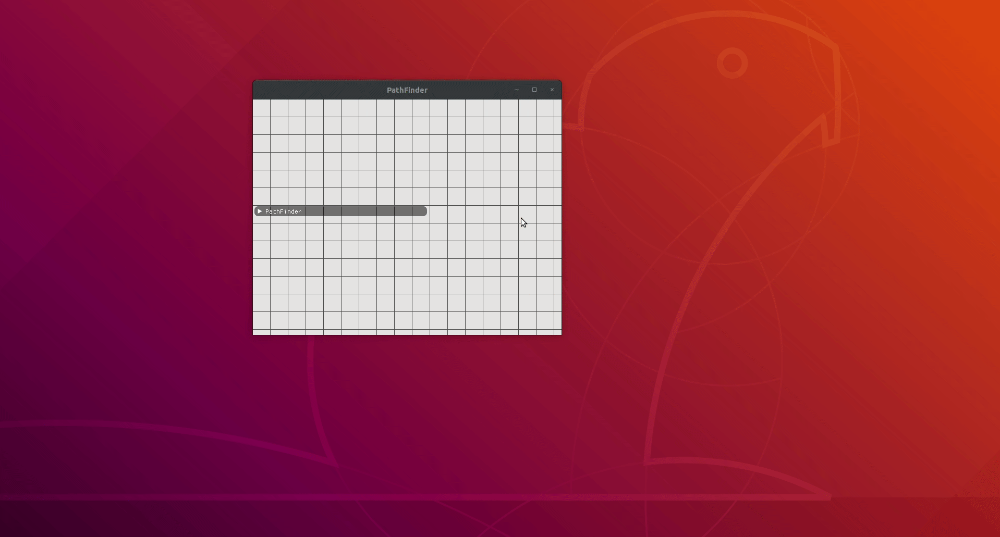

# Pathfinder

### Pathfinder is an application coded in C++ and OpenGL that visualise the most popular searching algorithms in action.
You can switch modes between:
* Start (press 's')
* Finish (press 'f')
* Wall (press 'w')

Available algorithms to explore:
* A Star Algorithm
* Dijkstra Algorithm
* Breadth First Search Algorithm

Zoom in and out with scroll wheel. You can also resize window at any time!

